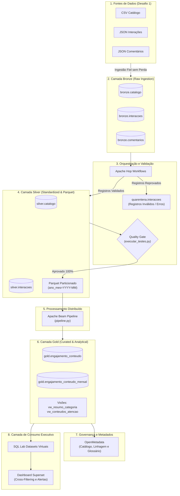

# RF19 — Definição da Arquitetura de Dados: ETL, ELT e Arquitetura Híbrida

**Programa:** FIC DEV IA — Programador de Sistemas com IA  
**Módulo:** Fundamentos de Dados para IA  
**Projeto:** Pipeline Governado, Escalável e Seguro de Conteúdos Educacionais  

---

## 1. Visão Geral da Arquitetura Adotada

O projeto evoluiu da abordagem pontual do Desafio 1 para uma **Arquitetura Híbrida Moderna (Medallion Architecture)** combinando os paradigmas de **ETL (Extract, Transform, Load)** e **ELT (Extract, Load, Transform)** ao longo das diferentes camadas de maturidade do dado.

```text
┌────────────────────────────────────────────────────────────────────────────────────────────────────────┐
│                               FLUXO INTEGRADO DA ARQUITETURA HÍBRIDA                                  │
├─────────────────┬──────────────────────┬──────────────────────┬────────────────────────────────────────┤
│ Macro-Etapa     │ Camadas Envolvidas   │ Paradigma Dominante  │ Motor de Execução Tecnológico          │
├─────────────────┼──────────────────────┼──────────────────────┼────────────────────────────────────────┤
│ 1. Ingestão     │ Fontes -> Bronze     │ EL (Extract & Load)  │ Apache Hop (Pipelines HPL)             │
├─────────────────┼──────────────────────┼──────────────────────┼────────────────────────────────────────┤
│ 2. Padronização │ Bronze -> Silver     │ ETL / Limpeza        │ Apache Hop (Validação e Quarentena)    │
├─────────────────┼──────────────────────┼──────────────────────┼────────────────────────────────────────┤
│ 3. Agregação    │ Silver -> Parquet    │ Processamento        │ Apache Beam (DirectRunner / Spark)     │
│    Distribuída  │ -> Camada Gold       │ Escalável (Distributed)│ com particionamento ano_mes            │
├─────────────────┼──────────────────────┼──────────────────────┼────────────────────────────────────────┤
│ 4. Consumo      │ Gold -> Superset     │ ELT / In-Database    │ PostgreSQL Engine (Views & SQL Lab)    │
│    Analítico    │                      │ Virtual Datasets     │ com cache no Apache Superset           │
└─────────────────┴──────────────────────┴──────────────────────┴────────────────────────────────────────┘
```

---

## 2. Diagrama de Fluxo Ponta a Ponta (Arquitetura Medallion)



---

## 3. Classificação e Identificação das Fases (Extração, Transformação e Carga)

| Fase no Pipeline | Onde Ocorre | Paradigma | Descrição da Operação |
|---|---|---|---|
| **E (Extração)** | Leitura das fontes (arquivos CSV, JSON e conexões PostgreSQL) | `E` | Leitura em streaming/chunks preservando dados brutos originais. |
| **L1 (Carga Bronze)** | Escrita em `bronze.*` | `L` | Carga imutável com metadados de auditoria (`origem_arquivo`, `data_hora_ingestao`, `execucao_id`). |
| **T1 (Transformação Silver)** | Apache Hop Pipelines | `T` | Tipagem, tratamento de nulos, deduplicação por chave de negócio e separação de anomalias na Quarentena. |
| **L2 (Carga Silver)** | Escrita em `silver.*` e arquivos Parquet | `L` | Armazenamento colunar estruturado e otimizado para analítica distribuída. |
| **T2 (Transformação Distribuída)** | Apache Beam | `T` | Agregações de engajamento, percentual de conclusão e métricas temporais por janela de negócio. |
| **L3 (Carga Gold)** | Escrita em `gold.*` | `L` | Carga das tabelas consolidadas preparadas para consultas analíticas. |
| **T3 (Transformação In-Database)** | PostgreSQL Views / SQL Lab | `T` | Enriquecimento sob demanda com expressões condicionais (`CASE WHEN`) e junções analíticas consumidas pelo Superset. |

---

## 4. Justificativa da Escolha Arquitetural

A escolha por uma **arquitetura híbrida** fundamenta-se nos seguintes pilares de engenharia:

1. **Custo Computacional Otimizado:** Transformações volumosas de agregação temporal são delegadas ao Apache Beam sobre arquivos Parquet colunares, poupando a CPU do banco de dados relacional durante cálculos pesados.
2. **Governança e Rastreabilidade Integral (Data Lineage):** Ao manter a camada Bronze imutável, qualquer necessidade de auditoria ou investigação de incidentes pode ser reproduzida a partir da origem sem risco de corrupção.
3. **Desempenho de Consumo (Low Latency):** O Apache Superset não consulta tabelas transacionais nem a camada Bronze. Todas as consultas operam na Camada Gold pré-agregada e nos datasets virtuais otimizados.
4. **Resiliência e Reprocessamento (Data Recovery):** Em caso de falha em regras de negócio, os dados isolados na Quarentena podem ser reprocessados pelo Apache Hop sem necessidade de reingerir o arquivo bruto original.

---

## 5. Limitações da Solução Anterior (Desafio 1) vs Ganhos do Desafio 2

```text
┌─────────────────────────────┬──────────────────────────────────────┬────────────────────────────────────────┐
│ Aspecto Técnico             │ Desafio 1 (Scripts Isolados)         │ Desafio 2 (Arquitetura Híbrida)        │
├─────────────────────────────┼──────────────────────────────────────┼────────────────────────────────────────┤
│ Orquestração                │ Scripts Python soltos executados     │ Workflows formais no Apache Hop com    │
│                             │ manualmente em ordem arbitrária.     │ tratamento de erros e dependências.    │
├─────────────────────────────┼──────────────────────────────────────┼────────────────────────────────────────┤
│ Gestão de Falhas            │ O script quebrava totalmente ao      │ Registros inválidos são desviados para │
│                             │ encontrar um dado inconsistente.     │ Quarentena, permitindo fluxo contínuo. │
├─────────────────────────────┼──────────────────────────────────────┼────────────────────────────────────────┤
│ Escalabilidade              │ Processamento monolítico na memória  │ Processamento particionado Parquet com │
│                             │ da máquina do desenvolvedor.         │ Apache Beam distribuível para Spark.   │
├─────────────────────────────┼──────────────────────────────────────┼────────────────────────────────────────┤
│ Governança e Linhagem       │ Metadados e regras dispersos em      │ Catálogo centralizado no OpenMetadata  │
│                             │ comentários ou desconhecidos.        │ com termos de negócio e linhagem visual│
├─────────────────────────────┼──────────────────────────────────────┼────────────────────────────────────────┤
│ Consumo Analítico           │ Consultas manuais pontuais em SQL.   │ Dashboard interativo no Superset com   │
│                             │                                      │ Cross-Filtering e Alertas por SLA.     │
└─────────────────────────────┴──────────────────────────────────────┴────────────────────────────────────────┘
```
