# Documentação de Linhagem de Dados (Data Lineage)

**Programa:** FIC DEV IA — Programador de Sistemas com IA  
**Módulo:** Fundamentos de Dados para IA  
**Projeto:** Pipeline Governado, Escalável e Seguro de Conteúdos Educacionais  
**Versão:** 1.0 — 2026  

---

## 1. Apresentação e Escopo da Linhagem

A presente documentação descreve formalmente o fluxo unidirecional e auditável de dados da plataforma educacional, cobrindo o percurso completo desde os arquivos de origem até a camada final de consumo e tomada de decisão estratégica no Apache Superset.

O objetivo desta especificação é garantir **confiabilidade institucional**, **reprodutibilidade técnica** e atendimento às exigências regulatórias de **auditoria de dados** e **governança**.

---

## 2. Diagrama de Linhagem Ponta a Ponta

```mermaid
graph LR
    subgraph S1_Ingestao [Camada de Ingestão]
        F_CAT["catalogo.csv"]
        F_INT["interacoes.json"]
        F_COM["comentarios.json"]
        F_REC["recomendacoes (D1)"]
    end

    subgraph S2_Bronze [Camada Bronze: Imutável e Auditável]
        B_CAT[("bronze.catalogo")]
        B_INT[("bronze.interacoes")]
        B_COM[("bronze.comentarios")]
        B_REC[("bronze.recomendacoes")]
    end

    subgraph S3_Silver [Camada Silver: Conforme e Quarentenada]
        S_CAT[("silver.catalogo")]
        S_INT[("silver.interacoes")]
        S_COM[("silver.comentarios")]
        S_REC[("silver.recomendacoes")]
        Q_ERR[("quarentena.*")]
    end

    subgraph S4_Distribuido [Camada Big Data: Apache Beam]
        PQ_SILVER["Parquet Silver Particionado (ano_mes)"]
        BEAM_JOB["Apache Beam: Agrupamento por Conteúdo"]
        PQ_GOLD["Parquet Agregado Staging"]
    end

    subgraph S5_Gold [Camada Gold: Analítica e Otimizada]
        G_ENG[("gold.engajamento_conteudo")]
        G_MEN[("gold.engajamento_conteudo_mensal")]
        V_CAT[("gold.vw_resumo_categoria")]
        V_ATN[("gold.vw_conteudos_atencao")]
    end

    subgraph S6_SQLLab [Camada Semântica: SQL Lab]
        DS_ENG["ds_virtual_desempenho_engajamento_conteudos"]
        DS_TEM["ds_virtual_evolucao_temporal_eficiencia"]
    end

    subgraph S7_Dashboard [Camada Executiva: Apache Superset]
        DASH["Dashboard Executivo de Engajamento"]
        KPI_CONC["KPI: Taxa de Conclusão Global"]
        KPI_RISCO["KPI: Cursos em Risco de Evasão"]
        ALERT_EVASAO["Alerta Automatizado de Evasão"]
    end

    %% Conexões
    F_CAT -->|Hop: bronze_catalogo.hpl| B_CAT
    F_INT -->|Hop: bronze_interacoes.hpl| B_INT
    F_COM -->|Hop: bronze_comentarios.hpl| B_COM
    F_REC -->|Ingestão de Continuidade| B_REC

    B_CAT -->|Hop: silver_catalogo.hpl| S_CAT
    B_CAT -.->|Inconsistências| Q_ERR
    B_INT -->|Hop: silver_interacoes.hpl| S_INT
    B_INT -.->|Inconsistências| Q_ERR
    B_COM -->|Hop: silver_comentarios.hpl| S_COM
    B_REC -->|Padronização| S_REC

    S_INT -->|exportar_parquet.py| PQ_SILVER
    PQ_SILVER -->|pipeline_beam.py| BEAM_JOB
    BEAM_JOB --> PQ_GOLD
    PQ_GOLD -->|carregar_gold.py + JOIN silver.catalogo| G_ENG
    S_INT -->|Agregação Mensal SQL| G_MEN

    G_ENG --> V_CAT
    G_ENG --> V_ATN
    G_ENG --> DS_ENG
    G_MEN --> DS_TEM

    DS_ENG --> DASH
    DS_TEM --> DASH
    V_CAT --> DASH
    V_ATN --> KPI_RISCO
    V_ATN --> ALERT_EVASAO
    DS_ENG --> KPI_CONC
```

---

## 3. Matriz de Transformações e Contratos de Dados

| Origem (De) | Destino (Para) | Mecanismo | Transformação Aplicada | Regra de Negócio / Qualidade |
| :--- | :--- | :--- | :--- | :--- |
| `catalogo.csv` | `bronze.catalogo` | Apache Hop | Cópia literal auditada | Inserção de `execucao_id` e carimbo de data/hora sem alterar texto original. |
| `bronze.catalogo` | `silver.catalogo` | Apache Hop | Parsing de datas e limpeza | Conversão de tipos (`FLOAT8`, `DATE`), remoção de espaços e quarentena de IDs nulos. |
| `interacoes.json`| `bronze.interacoes`| Apache Hop | Parsing JSONB | Preservação do JSON estruturado na íntegra com metadados de ingestão. |
| `bronze.interacoes`| `silver.interacoes`| Apache Hop | Desaninhamento e tipagem | Extração de atributos do JSONB para colunas relacionais com validação de chaves. |
| `silver.interacoes`| Parquet Particionado | Python / PyArrow | Particionamento em disco | Criação da partição `ano_mes = YYYY-MM` baseada no timestamp da interação. |
| Parquet Silver | Parquet Gold Staging | Apache Beam | Agregação distribuída | `CombinePerKey` somando total de interações, segundos e conclusões por `conteudo_id`. |
| Parquet Gold | `gold.engajamento_conteudo` | Python / psycopg | Carga relacional e enriquecimento | `LEFT JOIN` com `silver.catalogo` para recuperar título, nível e categoria. |
| `gold.engajamento_conteudo` | `ds_virtual_desempenho` | SQL Lab | Visualização virtual | `CASE WHEN` calculando status de retenção e taxa efetiva de conclusão. |
| `ds_virtual_desempenho` | Dashboard Superset | Apache Superset | Renderização analítica | Aplicação de filtros cruzados e formatação de métricas executivas. |

---

## 4. Garantia de Rastreabilidade e Reprodutibilidade

Qualquer métrica exibida na diretoria (por exemplo: um gráfico de evasão no Superset) pode ter sua linhagem auditada em minutos seguindo a chave primária `conteudo_id`:

1. No Superset: identifica-se a consulta base do gráfico (`ds_virtual_desempenho_engajamento_conteudos`);
2. No PostgreSQL: consulta-se a linha correspondente em `gold.engajamento_conteudo`;
3. No Lakehouse/Parquet: valida-se a soma consolidada na partição gerada pelo Apache Beam;
4. Na camada Silver: executa-se a contagem de linhas em `silver.interacoes` para aquele ID;
5. Na camada Bronze: verifica-se a integridade do JSON original arquivado na ingestão inicial.

Essa arquitetura elimina divergências entre relatórios e confere **segurança operacional e jurídica** à tomada de decisões da plataforma.
