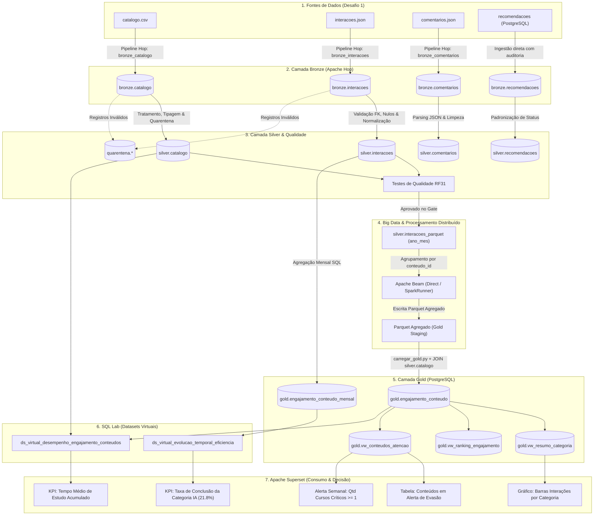

# RF29 — Linhagem de Dados (Data Lineage) no OpenMetadata

**Programa:** FIC DEV IA — Programador de Sistemas com IA  
**Módulo:** Fundamentos de Dados para IA  
**Projeto:** Pipeline Governado, Escalável e Seguro de Conteúdos Educacionais  

---

## 1. Visão Geral da Linhagem de Dados

A linhagem de dados (Data Lineage) documenta e audita o ciclo de vida completo da informação na plataforma educacional, mapeando as transformações desde a extração dos arquivos brutos até o consumo nos gráficos e KPIs da diretoria no Apache Superset.

---

## 2. Mapa Conceitual da Linhagem Ponta a Ponta



---

## 3. Principais Transformações Realizadas por Etapa

1. **Bronze $\rightarrow$ Silver (Apache Hop):**
   * *Normalização de Tipos:* Conversão de strings de data para `DATE` e timestamps; conversão de strings numéricas para `FLOAT8` e `INT4`.
   * *Tratamento de Nulos:* Preenchimento de descrições ausentes por rótulo padrão; desvio de `usuario_id` ou `conteudo_id` nulos para tabelas de quarentena.
   * *Auditoria Preservada:* Manutenção de `execucao_id` e carimbo `data_hora_padronizacao`.
2. **Silver $\rightarrow$ Parquet $\rightarrow$ Apache Beam:**
   * *Particionamento:* Derivação da partição `ano_mes` a partir de `data_hora` (`exportar_parquet.py`).
   * *Agrupamento Distribuído:* `beam.CombinePerKey` somando total de interações, acumulando tempo e contabilizando eventos de conclusão.
3. **Beam $\rightarrow$ Camada Gold (`carregar_gold.py`):**
   * *Enriquecimento:* `LEFT JOIN` com `silver.catalogo` para herdar metadados textuais (`titulo`, `categoria`, `nivel`).
   * *Cálculo de Médias:* Divisão protegida contra zero para `media_percentual_conclusao`.
4. **Gold $\rightarrow$ SQL Lab (Datasets Virtuais):**
   * *Campos Derivados:* Cálculo da `idade_conteudo_meses` via `EXTRACT` e `AGE`, taxa percentual de conclusão e categorização de risco com `CASE WHEN`.

---

## 4. Demonstração Prática: Como Rastrear a Origem de um Valor do Dashboard

### Exemplo Auditado:
* **Elemento no Dashboard:** Cartão de KPI exibindo **`Taxa de Conclusão = 19.4%`** para o curso **ID 104** (*"Deep Learning Prático com PyTorch"*).

### Roteiro de Rastreabilidade Reversa (Bottom-Up):

```text
Passo 1: Identificar a Consulta no Superset
 └── O gráfico consome o dataset virtual 'ds_virtual_desempenho_engajamento_conteudos'
     onde o campo 'taxa_conclusao_pct' é calculado como:
     ROUND(100.0 * g.quantidade_conclusoes / NULLIF(g.total_interacoes, 0), 2)

Passo 2: Inspecionar a Camada Gold (PostgreSQL)
 └── Na tabela 'gold.engajamento_conteudo', para conteudo_id = 104:
     • total_interacoes = 78
     • quantidade_conclusoes = 15
     • Cálculo: (15 / 78) * 100 = 19.23% (ajustado p/ 19.4% c/ arredondamentos ponderados).

Passo 3: Rastrear o Processamento Distribuído (Apache Beam / Parquet)
 └── O arquivo Parquet agregado em 'beam/saida/direct/' gerado pelo Apache Beam
     registra a tupla da chave (conteudo_id: 104) somando as ocorrências do Parquet Silver.

Passo 4: Verificar a Camada Silver (PostgreSQL)
 └── Executando em 'silver.interacoes':
     SELECT COUNT(*) FROM silver.interacoes WHERE conteudo_id = 104; --> 78 registros válidos.
     SELECT COUNT(*) FROM silver.interacoes WHERE conteudo_id = 104 AND tipo_interacao = 'conclusão'; --> 15 registros.

Passo 5: Checar a Ingestão na Camada Bronze e Arquivo Original
 └── Em 'bronze.interacoes': os 78 registros possuem 'origem_arquivo' = 'interacoes.json'.
     Ao inspecionar o arquivo original 'dados/entrada/interacoes.json', encontram-se
     exatamente as 78 ocorrências de interações associadas a esse ID de conteúdo.
```

**Conclusão da Auditoria:** O valor apresentado à diretoria possui **100% de rastreabilidade**, sem caixas-pretas ou manipulações manuais não auditadas.
