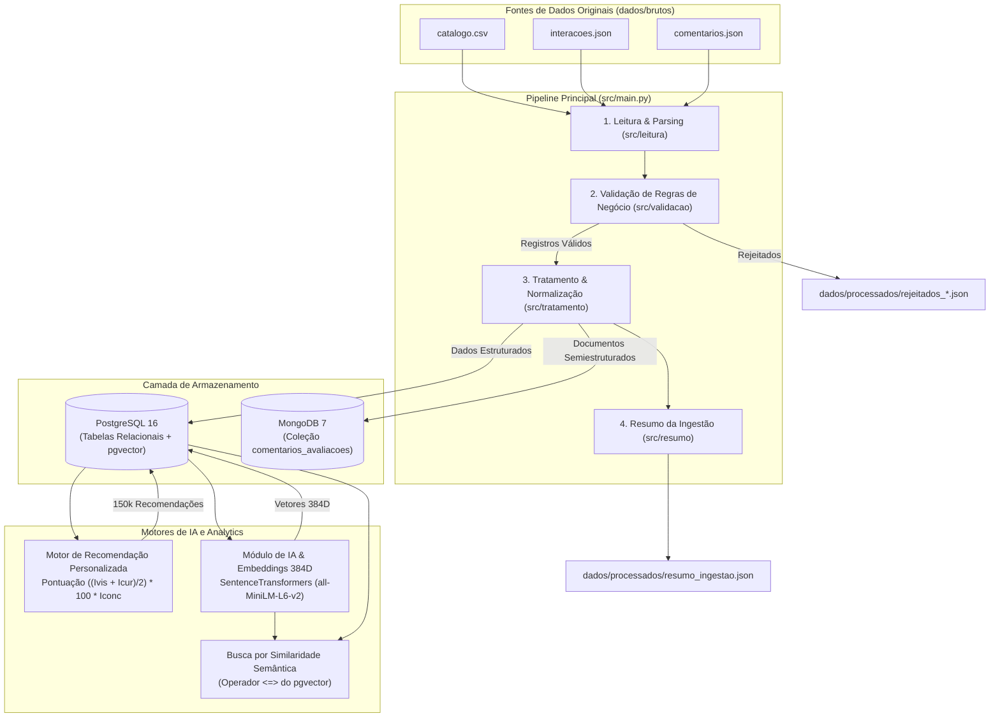

# Arquitetura da Solução de Dados

Este documento descreve a arquitetura técnica, o fluxo de processamento de dados e as decisões de engenharia adotadas na implementação do **Desafio Prático 1 — Fundamentos de Dados para IA (FIC_DEV)**.

---

## 1. Visão Geral da Arquitetura

A solução adota uma arquitetura em camadas orientada a DataOps, onde um pipeline centralizado orquestra a leitura de fontes heterogêneas, validação, padronização, persistência relacional e NoSQL, geração de vetores semânticos, cálculo de recomendações personalizadas e disponibilização de logs.

---

## 2. Componentes da Solução

### 2.1. Ingestão e Validação (`src/leitura`, `src/validacao`, `src/tratamento`)
- **Fontes de Entrada:** Arquivos `catalogo.csv`, `interacoes.json` e `comentarios.json` localizados em `dados/brutos/`.
- **Validação de Regras:** Cada registro é classificado como `valido`, `invalido`, `incompleto` ou `duplicado`.
- **Tratamento de Dados:** Normalização de strings, conversão de datas para o padrão ISO-8601, deduplicação por chave de negócio e sanitização de números.
- **Saídas em Disco:** Registros tratados e rejeitados gravados em `dados/processados/`.

### 2.2. Armazenamento Relacional (PostgreSQL 16 + `pgvector`)
- **Tabelas do Modelo Lógico:**
  - `categorias`: Áreas temáticas normalizadas.
  - `usuarios`: Entidade derivada a partir das interações e comentários.
  - `conteudos`: Catálogo educacional estruturado.
  - `interacoes`: Eventos de consumo (visualização, início, conclusão, curtida, avaliação).
  - `avaliacoes_resumo`: Resumo das avaliações relacionais.
  - `recomendacoes`: Armazenamento das recomendações geradas ($I_{vis}$, $I_{cur}$, $I_{conc}$).
  - `conteudo_embeddings`: Armazenamento de vetores de 384 dimensões via extensão `pgvector`.
- **Índices Otimizados:** Índice HNSW no campo `embedding` para busca veloz por similaridade de cosseno (`vector_cosine_ops`).

### 2.3. Armazenamento NoSQL (MongoDB 7)
- **Coleção `comentarios_avaliacoes`:** Armazena o documento completo semiestruturado (texto livre dos comentários e array de `tags`), denormalizando a `categoria` para acelerar agregações sem a necessidade de joins.

### 2.4. Motor de Recomendação (`src/recomendacao/motor.py`)
- **Algoritmo de Afinidade (RF10/RF11):**
  $$\text{Pontuação} = \left(\frac{I_{vis} + I_{cur}}{2}\right) \times 100 \times I_{conc}$$
  - $I_{vis}$: Proporção de tempo consumido pelo usuário na mesma categoria do conteúdo.
  - $I_{cur}$: Proporção do histórico de curtidas e avaliações positivas ($\ge 4$) na categoria.
  - $I_{conc}$: Filtro binário ($0$ para conteúdos já concluídos pelo usuário, $1$ para não concluídos).
- **Classificação de Status:** `positivo` ($\ge 70$), `estavel` ($40 \le P < 70$) e `negativo` ($P \le 40$ ou $Iconc = 0$).

### 2.5. Módulo de IA e Busca Semântica (`src/ia/embeddings.py`)
- **Vetorização (RF08):** Concatenação de `titulo` + `descricao` codificada com o modelo neural `sentence-transformers/all-MiniLM-L6-v2` (384D).
- **Trava de Duplicidade:** Verificação prévia dos IDs com vetores gravados em `conteudo_embeddings` antes do reprocessamento, garantindo idempotência.
- **Busca Semântica (RF09):** Converte a consulta em linguagem natural em embedding e ordena o catálogo via distância de cosseno (`<=>`) com limite `top_n` configurável.

---

## 3. Práticas de DataOps e Resiliência

1. **Gestão de Segredos e Parâmetros:** Separação estrita de credenciais em `.env` (não versionado) e configurações em `config/config.yaml`.
2. **Idempotência:** Uso de restrições de unicidade (`ON CONFLICT DO NOTHING`) e travas lógicas para permitir reexecuções seguras sem duplicação de dados.
3. **Logs Estruturados (RF14):** Registros detalhados com timestamps e níveis de gravidade em `logs/execucao.log`.
4. **Reprodutibilidade:** Ambiente containerizado via Docker Compose (`docker-compose.yml`) incluindo o serviço PostgreSQL com suporte nativo a `pgvector`.
